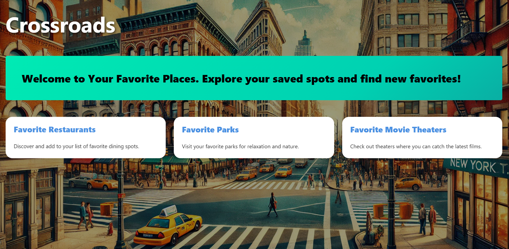
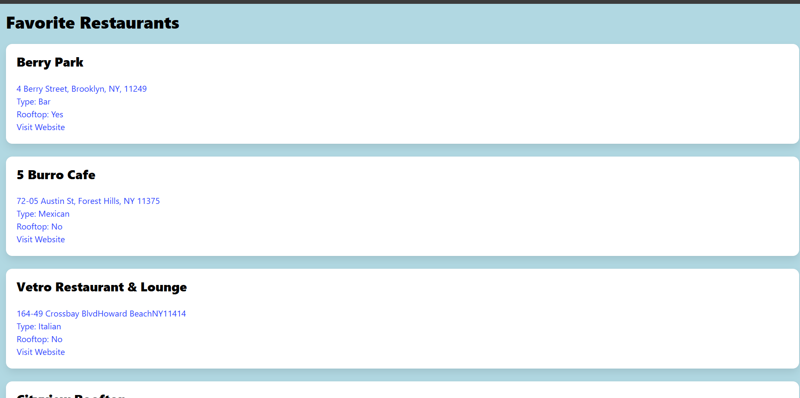
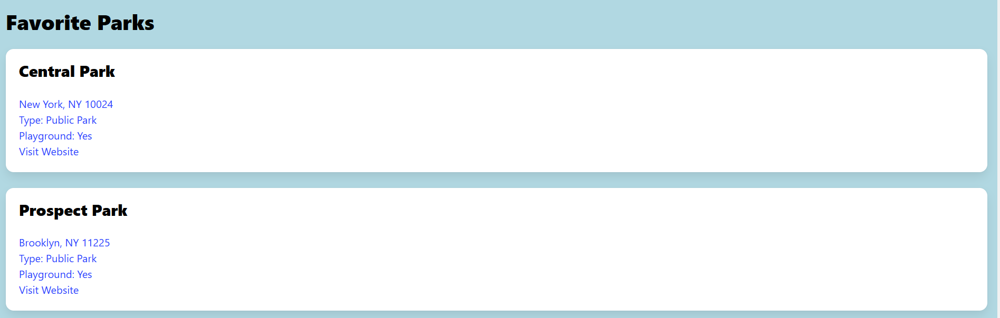
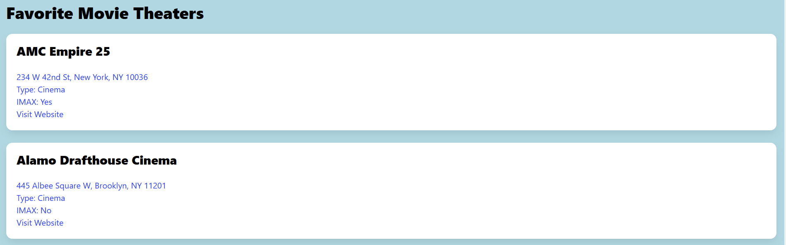

# Crossroads

## Description
Our second project for for our columbia coding bootcamp class. This application allowes the user to save their favorites places. They can add and delete placess as they see fit. 

## User Story 
As a user, 
I want to Save my favorite restaurants, parks, movie theaters. So in the future i can view my favorite place to help me decide where i should go.   

### How Does it work?
When I open the application. I can select from three categories; Restaurants, Parks, and Movie Theaters. When i click on one of the categories, 
then I am redirected to another page where I see the list of save places. The name, the location, the type of place, and a link to the place website is displayed. 
Using the GoogleMap API and wheter API, a traffic map and weather roports are displayed. 

### Usage?
It will help you decide where to go if you have trouble deciding. 
By showing you the traffic and wheather, you can make a more informed decision. 
It helps you keep track of places you like. 

## Link to Deployed Application:
https://crossroads-2.onrender.com/

## Link to Presentation Template:
https://docs.google.com/presentation/d/1cxeIOWUiC6uOvXbfZA4Vi1NJA_eSyBJl3oBOk19_R2Y/edit#slide=id.g29f43f0a72_0_24

## Credits
  This project was developed by Oscar Ayala (https://github.com/gggrouchy), Kamal Uddin (https://github.com/kamal21087) and Ryan Fredericks (https://github.com/Kurt1717)

## License
  MIT license